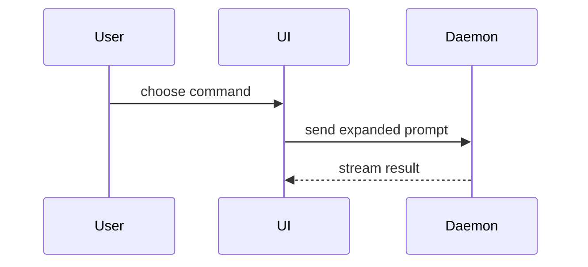

# Show Me

Skip the preamble and keep prose brief. **One visual per point** — pick the
single smallest view that makes it, and place it next to the short text it
supports. Keep only the calls, files, props, states, and boundaries needed to
answer the current question; everything else is noise the user reads past.

## Shapes

Show logic or an algorithm as pseudocode:

```text
on(save)
  if content is unchanged
    return cached result
  write new content
  return fresh result
```

Show runtime control flow as a call tree:

```text
submitForm
  createSession
    persistPrompt
    launchAgent
  navigateToSession
```

Show UI structure as a component tree, including state and module boundaries
that matter:

```text
<SessionPage> (apps/example/src/routes/session.tsx)
  useSessionEvents()
  <SessionToolbar>
    <RunSkillButton> (packages/ui)
```

Show file responsibility or a broad refactor as a shallow file tree:

```text
src/
├── commands/       # parses user actions
├── sessions/       # owns session state
└── transport.ts    # sends API requests
```

Show component interaction or data flow with Mermaid — but only when the surface
renders it. Web and desktop chat clients do; terminal clients print the fence as
raw text, which is worse than the prose it replaced. When it won't render, draw
the same diagram as hand-written SVG or CSS boxes-and-arrows in an HTML page
(below); that page carries no Mermaid runtime.



## Framing

Render any shape above as a `diff` when the point is what changes and the
surrounding shape already exists:

```diff
 src/
 ├── commands/
+│   └── show-me.ts       # expands the slash command
 ├── sessions/
-└── transport.ts
+└── transport/
+    ├── client.ts
+    └── stream.ts
```

Show the whole block instead when most of it is new, when omitted context would
hide ownership or order, or when the user needs a copyable target shape:

```ts
function expandSkill(command: string): string {
  const skillName = command.slice(1);
  return `use the ${skillName} skill`;
}
```

## An HTML page

For a visual UI, layout, state comparison, or concept too dense for the shapes
above, write one focused HTML file — a diagram, an infographic, or a short slide
deck, whichever fits the point. Match the product's colors, type, spacing, and
components; use real labels and data; support desktop and mobile.

Inline all CSS and JS, embed images as `data:` URIs, and make no outbound
requests, so the page renders without a network and leaks nothing about the
codebase to a third party.

Write it to the OS temp directory so nothing lands in the repo — resolve the
temp dir from `$TMPDIR`, falling back to `/tmp` (or `%TEMP%` on Windows), and
write to `<tmpdir>/show-me-<slug>-<timestamp>.html`, where `<slug>` is the topic
reduced to lowercase `[a-z0-9-]` and `<timestamp>` is `YYYYMMDD-HHMMSS`, so each
run gets a fresh file. Open it for the user — `xdg-open "<path>"` on Linux,
`open "<path>"` on macOS, `start "" "<path>"` on Windows — and tell them the
absolute path.
